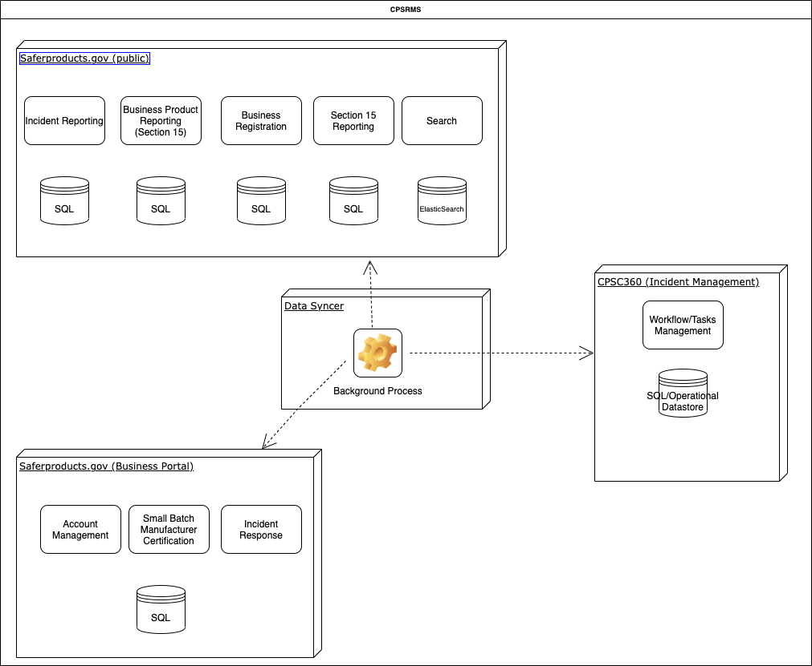

## CPSC Apps Documentation  

  
 

 
## Saferproducts.gov   

Located at www.saferproducts.gov, will allow the public to search for and review reports on consumer products, as well as the comments that manufacturers or private labelers provide in response to those reports.

The incident managemenet system is composed of a public portal, a data syncer, a business portal and an incident management application where business processes and  rules are applied to the incident reports before they are published to the public portal to be searchable.

#### Physical Architecture

 

### Technoligies Used

#### saferproducts.gov

.NET Core Core 3.x 

ASP.NET Core 3.x Razor pages 

Entity Frame Core 3.1.4 

Dapper 2.0.35 

Google reCAPTCHA v2 (I am not a robot) 

MailKit 2.6.0 

SQL Server 2012 R2 

Bootstrap/CSS/jQuery 

IronPdf (2020.0.0) 

Elasticsearch.Net 7.8.1 

NEST 7.7.1 

Log4net 3.1.0 

JDK 1.8.0 (needed for the Elasticsearch Engine) 

### CPSC 360

